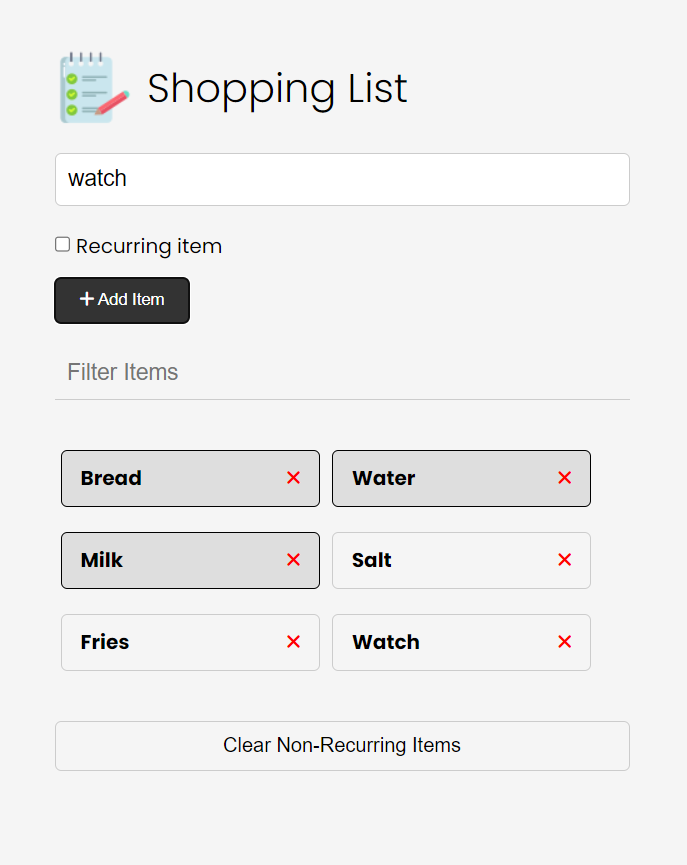

# Shopping List Vanila JS Project
Own javascript solution for Simple shopping list app from Brad Traversy's Modern Javascript Course.
Compared to te course's version, I added a daymode/ nightmode function activated by clicking the notebook icon from the title.
Another functionality added compared to the course is the 'Recurring items', which have special styiling and can't be deleted by Clear All button.

You can try it here: https://jolly-kheer-2a8ec4.netlify.app/